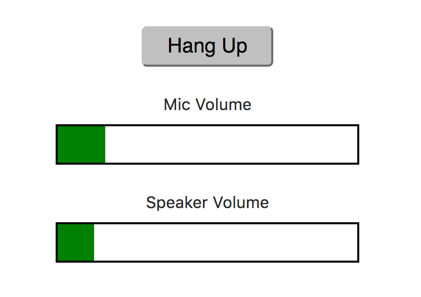
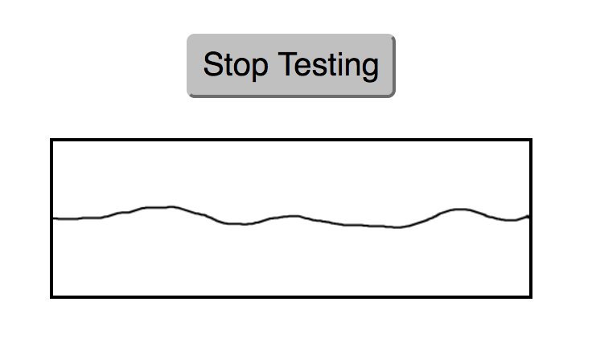

# Client JS 1.4 Audio API Examples

This repository contains implementation examples for the Audio API features included in Twilio Client JS 1.4.

## Install & Run

This repository contains the server-side component needed to generate tokens. In order to run the examples, you will
need to copy `config.example.js` to `config.js` and fill in your credentials. Any examples that make outbound calls
will call the application associated with the AppSid you enter into this file.

Once `config.js` is copied and modified with your info, you can start the server locally using `npm`:

```
npm install
npm start
```

The default port is 3030. If you'd like to use a custom port, the project looks for your `PORT` environment variable:

```
PORT=1337 npm start
```

Once running, you can open the index page by opening `http://localhost:3030` (or your custom port) in your
browser.

## Current Examples

### 1. Volume Indicators

This example illustrates how the `Connection.volume()` and `Device.Audio.inputVolume()` handlers can be used to
create visual volume indicator bars.



### 2. Waveform Visualization

This example illustrates how the MediaStream returned by `Connection.getLocalStream()` or `Connection.getRemoteStream()`
can be used to create a visualization of the audio track.


